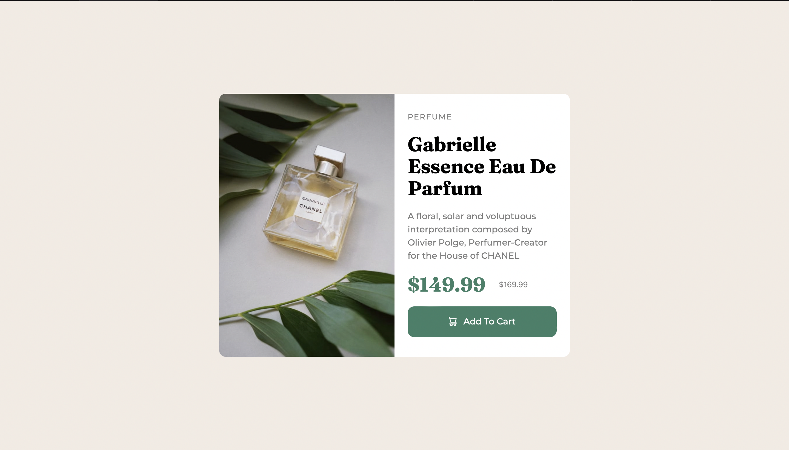

# Frontend Mentor - Product preview card component solution

This is a solution to the [Product preview card component challenge on Frontend Mentor](https://www.frontendmentor.io/challenges/product-preview-card-component-GO7UmttRfa). Frontend Mentor challenges help you improve your coding skills by building realistic projects. 

## Table of contents

- [Overview](#overview)
  - [The challenge](#the-challenge)
  - [Screenshot](#screenshot)
  - [Links](#links)
- [My process](#my-process)
  - [Built with](#built-with)
  - [What I learned](#what-i-learned)
  - [Continued development](#continued-development)
  - [Useful resources](#useful-resources)
- [Acknowledgments](#acknowledgments)

**Note: Delete this note and update the table of contents based on what sections you keep.**

## Overview

### The challenge

Users should be able to:

- View the optimal layout depending on their device's screen size
- See hover and focus states for interactive elements

### Screenshot
Desktop


Mobile 


### Links

- Solution URL: [Solution](https://github.com/Leozaur1808/product-preview-card-component-main)
- Live Site URL: [URL](https://leozaur1808.github.io/product-preview-card-component-main/)

## My process

### Built with

- Tailwindcss


### What I learned

Since it is my first tailwindcss experience, I had the ability to test out my knowledge and remind the topics that I had learned in the crash course before starting this. So I can't mention the particular thing or things I've learned here.

Though I would really appreciate if someone could have gave me the way of creating layout of this type without width usage

```html
<div class="sm:w-80">
```


### Continued development

I definitely need more practice of doing 

### Useful resources

- [Tailwindcss Crash Course](https://www.youtube.com/watch?v=dFgzHOX84xQ&t=1621s) - Crash Course on tailwindcss, that I watched before doing this challenge(note: this is my first experience with tailwindcss)

## Acknowledgments

I have used google and found some answers on stackoverflow about positioning the box in the centre. I think I could have figured out this by myself, but that gave me a good hint.

